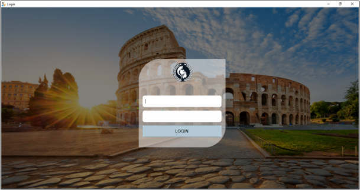
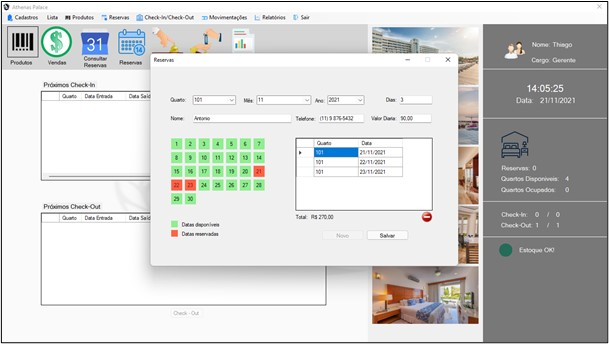
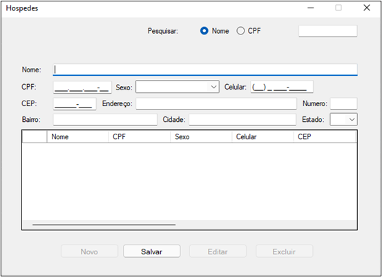
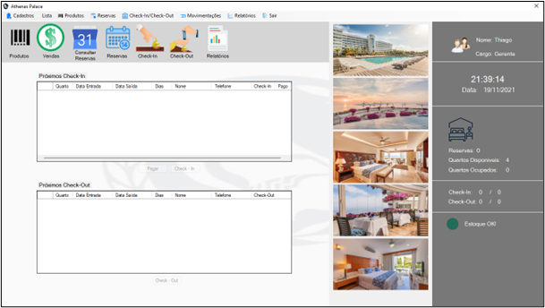

# Sistema Hoteleiro

Tela de reserva

Tela de login

Tela de cadastro Hospedes

Tela principal

> TCC - UNIP
Projeto desenvolvido com o tema de Sistema de gestão hoteleira em C# e SQL Server para o curso de Análise e Desenvolvimento de Sistemas.
O sistema pode efetuar:
- Login
- Reservas
- Consultar reservas
- Check-in/check out
- Cadastro de cliente
- Cadastro de funcionário
- Cadastro de quartos
- Cadastros de produtos
- Cadastros de serviços
- Gerar relatórios
- Notificação de baixa de estoque

## 🛠️ Tecnologias
- C#
- SQL Server

## Contato
[Linkedin](https://www.linkedin.com/in/thiago-papapietro-952360215)
